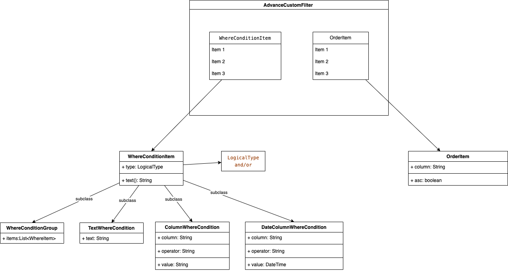

<!-- Copyright 2018 The FlutterCandies author. All rights reserved.
Use of this source code is governed by an Apache license
that can be found in the LICENSE file. -->

# photo_manager

English | [中文](README-ZH.md)

[][pub package]
[](https://pub.dev/packages/photo_manager)
[](https://github.com/fluttercandies/flutter_photo_manager/actions/workflows/runnable.yml)
[](https://github.com/fluttercandies/flutter_photo_manager/blob/main/LICENSE)

[](https://github.com/fluttercandies/flutter_photo_manager/stargazers)
[](https://github.com/fluttercandies/flutter_photo_manager/network)
[](https://github.com/Solido/awesome-flutter)
<a href="https://qm.qq.com/q/ZyJbSVjfSU"></a>

A Flutter plugin that provides assets abstraction management APIs without UI integration,
you can get assets (image/video/audio) on Android, iOS, macOS and OpenHarmony.

## Projects using this plugin

| name                 | pub                                                                                                                | github                                                                                                                                                                  |
|:---------------------|:-------------------------------------------------------------------------------------------------------------------|:------------------------------------------------------------------------------------------------------------------------------------------------------------------------|
| wechat_assets_picker | [](https://pub.dev/packages/wechat_assets_picker) | [](https://github.com/fluttercandies/flutter_wechat_assets_picker) |
| wechat_camera_picker | [](https://pub.dev/packages/wechat_camera_picker) | [](https://github.com/fluttercandies/flutter_wechat_camera_picker) |

## Articles about this plugin

- [Hard to manage media with Flutter? Try photo_manager, the all-in-one solution](https://medium.flutter.cn/hard-to-manage-media-with-flutter-try-photo-manager-the-all-in-one-solution-5188599e4cf)

## Migration guide

For versions upgrade across major versions,
see the [migration guide](MIGRATION_GUIDE.md) for detailed info.

<details>
  <summary>TOC</summary>

<!-- TOC -->
* [photo_manager](#photo_manager)
  * [Projects using this plugin](#projects-using-this-plugin)
  * [Articles about this plugin](#articles-about-this-plugin)
  * [Migration guide](#migration-guide)
  * [Common issues](#common-issues)
  * [Prepare for use](#prepare-for-use)
    * [Add the plugin reference to pubspec.yaml](#add-the-plugin-reference-to-pubspecyaml)
    * [Import in your projects](#import-in-your-projects)
    * [Configure native platforms](#configure-native-platforms)
      * [Android config preparation](#android-config-preparation)
        * [Kotlin, Gradle, AGP](#kotlin-gradle-agp)
        * [Android 10 (Q, 29)](#android-10-q-29)
        * [Glide](#glide)
      * [iOS config preparation](#ios-config-preparation)
  * [Usage](#usage)
    * [Request for permission](#request-for-permission)
      * [Limited entities access](#limited-entities-access)
        * [Limited entities access on iOS](#limited-entities-access-on-ios)
        * [Limited entities access on Android](#limited-entities-access-on-android)
    * [Get albums/folders (`AssetPathEntity`)](#get-albumsfolders-assetpathentity)
      * [Params of `getAssetPathList`](#params-of-getassetpathlist)
      * [PMPathFilterOption](#pmpathfilteroption)
    * [Get assets (`AssetEntity`)](#get-assets-assetentity)
      * [From `AssetPathEntity`](#from-assetpathentity)
      * [From `PhotoManager` (Since 2.6)](#from-photomanager-since-26)
      * [From ID](#from-id)
      * [From raw data](#from-raw-data)
      * [From iCloud](#from-icloud)
      * [Display assets](#display-assets)
      * [Get asset files](#get-asset-files)
      * [Obtain "Live Photos"](#obtain-live-photos)
        * [Filtering only "Live Photos"](#filtering-only-live-photos)
        * [Obtain the video from "Live Photos"](#obtain-the-video-from-live-photos)
      * [Limitations](#limitations)
        * [Android 10 media location permission](#android-10-media-location-permission)
        * [Usage of the original data](#usage-of-the-original-data)
        * [Long retrieving duration with file on iOS](#long-retrieving-duration-with-file-on-ios)
    * [Entities change notify](#entities-change-notify)
  * [Filtering](#filtering)
    * [FilterOptionGroup](#filteroptiongroup)
    * [CustomFilter](#customfilter)
      * [Advanced CustomFilter](#advanced-customfilter)
      * [Classes explanations](#classes-explanations)
  * [Cache mechanism](#cache-mechanism)
    * [Cache on Android](#cache-on-android)
    * [Cache on iOS](#cache-on-ios)
    * [Clear caches](#clear-caches)
  * [Native extra configs](#native-extra-configs)
    * [Android extra configs](#android-extra-configs)
      * [Glide issues](#glide-issues)
      * [Android 14 (API 34) extra configs](#android-14-api-34-extra-configs)
      * [Android 13 (API 33) extra configs](#android-13-api-33-extra-configs)
    * [iOS extra configs](#ios-extra-configs)
      * [Localized system albums name](#localized-system-albums-name)
    * [Experimental features](#experimental-features)
      * [Preload thumbnails](#preload-thumbnails)
      * [Delete entities](#delete-entities)
      * [Copy an entity](#copy-an-entity)
      * [Features for Android only](#features-for-android-only)
        * [Move an entity to another album](#move-an-entity-to-another-album)
        * [Remove all non-exist entities](#remove-all-non-exist-entities)
        * [Move entities to trash](#move-entities-to-trash)
      * [Features for iOS or macOS](#features-for-ios-or-macos)
        * [Create a folder](#create-a-folder)
        * [Create an album](#create-an-album)
        * [Remove the entity entry from the album](#remove-the-entity-entry-from-the-album)
        * [Delete `AssetPathEntity`](#delete-assetpathentity)
      * [Features for OpenHarmony](#features-for-openharmony)
<!-- TOC -->

</details>

## Common issues

Please search common issues in [GitHub issues][]
for build errors, runtime exceptions, etc.

## Prepare for use

### Add the plugin reference to pubspec.yaml

Two ways to add the plugin to your pubspec:

- **(Recommend)** Run `flutter pub add photo_manager`.
- Add the plugin reference in your `pubspec.yaml`'s `dependencies` section:

```yaml
dependencies:
  photo_manager: $latest_version
```

The latest stable version is:
[][pub package]

### Import in your projects

```dart
import 'package:photo_manager/photo_manager.dart';
```

### Configure native platforms

Minimum platform versions:
**Android 16, iOS 9.0, macOS 10.15**.

- Android: [Android config preparation](#android-config-preparation).
- iOS: [iOS config preparation](#ios-config-preparation).
- macOS: Pretty much the same with iOS.

#### Android config preparation

##### Kotlin, Gradle, AGP

We ship this plugin with **Kotlin `1.7.22`**.
If your projects use a lower version of Kotlin/Gradle/AGP,
please upgrade them to a newer version.

More specifically:

- Upgrade your Gradle version (`gradle-wrapper.properties`)
  to `7.5.1` or the latest version.
- Upgrade your Kotlin version (`ext.kotlin_version`)
  to `1.7.22` or the latest version.
- Upgrade your AGP version (`com.android.tools.build:gradle`)
  to `7.2.2` or the latest version.

##### Android 10 (Q, 29)

_If you're not setting your `compileSdkVersion` or `targetSdkVersion` to 29,
you can skip this section._

On Android 10, **Scoped Storage** was introduced,
which causes the origin resource file not directly
inaccessible through it file path.

If your `compileSdkVersion` or `targetSdkVersion` is `29`,
you can consider adding `android:requestLegacyExternalStorage="true"`
to your `AndroidManifest.xml` in order to obtain resources:

```xml
<manifest xmlns:android="http://schemas.android.com/apk/res/android"
    package="com.fluttercandies.photo_manager_example">

    <application
        android:label="photo_manager_example"
        android:icon="@mipmap/ic_launcher"
        android:requestLegacyExternalStorage="true">
    </application>
</manifest>
```

**Note: Apps that are using the flag will be rejected from the Google Play.**

This is not a requirement, the plugin can still work with caching files.
But you'll need to control caches on your own, the best practice is to clear file caches
each time when you start your app by calling `PhotoManager.clearFileCache()`.

##### Glide

The plugin use [Glide][] to create thumbnail bytes for Android.

If you found some warning logs with Glide appearing,
it means the main project needs an implementation of `AppGlideModule`.
See [Generated API][] for the implementation.

#### iOS config preparation

Define the `NSPhotoLibraryUsageDescription`
key-value in the `ios/Runner/Info.plist`:

```plist
<key>NSPhotoLibraryUsageDescription</key>
<string>In order to access your photo library</string>
```

If you want to grant only write-access to the photo library on iOS 11 and above,
define the `NSPhotoLibraryAddUsageDescription`
key-value in the `ios/Runner/Info.plist`.
It's pretty much the same as the `NSPhotoLibraryUsageDescription`.


## Usage

### Request for permission

Most of the APIs can only use with granted permission.

```dart
final PermissionState ps = await PhotoManager.requestPermissionExtend(); // the method can use optional param `permission`.
if (ps.isAuth) {
  // Granted
  // You can to get assets here.
} else if (ps.hasAccess) {
  // Access will continue, but the amount visible depends on the user's selection.
} else {
  // Limited(iOS) or Rejected, use `==` for more precise judgements.
  // You can call `PhotoManager.openSetting()` to open settings for further steps.
}
```

But if you're pretty sure your callers will be only called
after the permission is granted, you can ignore permission checks:
```dart
PhotoManager.setIgnorePermissionCheck(true);
```

For background processing (such as when the app is not in the foreground),
ignore permissions check would be proper solution.

You can also read the current permission state with
`PhotoManager.getPermissionState`. Make sure the same permission request option
is used between this request and other asset requests.

#### Limited entities access

##### Limited entities access on iOS

With iOS 14 released, Apple brought a "Limited Photos Library" permission
(`PermissionState.limited`) to iOS.
The `PhotoManager.requestPermissionExtend()` method will return `PermissionState`.
See [PHAuthorizationStatus][] for more detail.

To reselect accessible entities for the app,
use `PhotoManager.presentLimited()` to call the modal of
accessible entities' management.
This method only available for iOS 14+ and when the permission state
is limited (`PermissionState.limited`).

To suppress the automatic prompting from the system
when each time you access the media after the app has restarted,
you can set the `Prevent limited photos access alert` key to `YES`
in your app's `Info.plist` (or manually writing as below):

```plist
<key>PHPhotoLibraryPreventAutomaticLimitedAccessAlert</key>
<true/>
```

##### Limited entities access on Android

Android 14 (API 34) has also introduced the concept of limited assets similar to iOS.

However, there is a slight difference in behavior (based on the emulator):
On Android, the access permission to a certain resource cannot be revoked once it is granted,
even if it hasn't been selected when using `presentLimited` in future actions.

### Get albums/folders (`AssetPathEntity`)

Albums or folders are abstracted as the [`AssetPathEntity`][] class.
It represents a bucket in the `MediaStore` on Android,
and the `PHAssetCollection` object on iOS/macOS.
To get all of them:

```dart
final List<AssetPathEntity> paths = await PhotoManager.getAssetPathList();
```

See [`getAssetPathList`][] for more detail.

#### Params of `getAssetPathList`

| Name             | Description                                                                                                                    | Default value           |
|:-----------------|--------------------------------------------------------------------------------------------------------------------------------|-------------------------|
| hasAll           | Set to true when you need an album containing all assets.                                                                      | true                    |
| onlyAll          | Use this property if you only need one album containing all assets.                                                            | false                   |
| type             | Type of media resource (video, image, audio)                                                                                   | RequestType.common      |
| filterOption     | Used to filter resource files, see [Filtering](#filtering) for details                                                         | FilterOptionGroup()     |
| pathFilterOption | Only valid for iOS and macOS, for the corresponding album type. See [PMPathFilterOption](#pmpathfilteroption) for more detail. | Include all by default. |

#### PMPathFilterOption

Provide since 2.7.0, currently only valid for iOS and macOS.

```dart
final List<PMDarwinAssetCollectionType> pathTypeList = []; // use your need type
final List<PMDarwinAssetCollectionSubtype> pathSubTypeList = []; // use your need type
final darwinPathFilterOption = PMDarwinPathFilter(
      type: pathTypeList,
      subType: pathSubTypeList,
    );
PMPathFilter pathFilter = PMPathFilter();
```

The `PMDarwinAssetCollectionType` has a one-to-one correspondence with [PHAssetCollectionType | Apple Developer Documentation](https://developer.apple.com/documentation/photokit/phassetcollectiontype?language=objc).

The `PMDarwinAssetCollectionSubtype` has a one-to-one correspondence with [PHAssetCollectionSubType | Apple Developer Documentation](https://developer.apple.com/documentation/photokit/phassetcollectionsubtype?language=objc).

### Get assets (`AssetEntity`)

Assets (images/videos/audios) are abstracted as the [`AssetEntity`][] class.
It represents a series of fields with `MediaStore` on Android,
and the `PHAsset` object on iOS/macOS.

#### From `AssetPathEntity`

You can use [the pagination method][`getAssetListPaged`]:

```dart
final List<AssetEntity> entities = await path.getAssetListPaged(page: 0, size: 80);
```

Or use [the range method][`getAssetListRange`]:

```dart
final List<AssetEntity> entities = await path.getAssetListRange(start: 0, end: 80);
```

#### From `PhotoManager` (Since 2.6)

First, You need get count of assets:

```dart
final int count = await PhotoManager.getAssetCount();
```

Then, you can use [the pagination method][`PhotoManager.getAssetListPaged`]:

```dart
final List<AssetEntity> entities = await PhotoManager.getAssetListPaged(page: 0, pageCount: 80);
```

Or use [the range method][`PhotoManager.getAssetListRange`]:

```dart
final List<AssetEntity> entities = await PhotoManager.getAssetListRange(start: 0, end: 80);
```

**Note:** `page` and `start` starts from **0**.

#### From ID

The ID concept represents:

- The ID field of the `MediaStore` on Android.
- The `localIdentifier` field of the `PHAsset` on iOS.

You can store the ID if you want to implement features
that's related to persistent selections.
Use [`AssetEntity.fromId`][] to retrieve the entity
once you persist an ID.

```dart
final AssetEntity? asset = await AssetEntity.fromId(id);
```

Be aware that the created asset might have
limited access or got deleted in anytime,
so the result might be null.

#### From raw data

You can create an entity from raw data,
such as downloaded images, recorded videos, etc.
The created entity will show as a corresponding resource
on your device's gallery app.

```dart
final Uint8List rawData = yourRawData;

// Save an image to an entity from `Uint8List`.
final AssetEntity? entity = await PhotoManager.editor.saveImage(
  rawData,
  title: 'write_your_own_title.jpg', // Affects EXIF reading.
);

// Save an existed image to an entity from it's path.
final AssetEntity? imageEntityWithPath = await PhotoManager.editor.saveImageWithPath(
  path, // Use the absolute path of your source file, it's more like a copy method.
  title: 'same_as_above.jpg',
);

// Save a video entity from `File`.
final File videoFile = File('path/to/your/video.mp4');
final AssetEntity? videoEntity = await PhotoManager.editor.saveVideo(
  videoFile, // You can check whether the file is exist for better test coverage.
  title: 'write_your_own_title.mp4',
);

// [iOS only] Save a live photo from image and video `File`.
// This only works when both image and video file were part of same live photo.
final File imageFile = File('path/to/your/live_photo.heic');
final File videoFile = File('path/to/your/live_video.mp4');
final AssetEntity? entity = await PhotoManager.editor.darwin.saveLivePhoto(
  imageFile: imageFile,
  videoFile: videoFile,
  title: 'write_your_own_title.heic',
);
```

Be aware that the created asset might have limited access or got deleted in anytime,
so the result might be null.

iOS and macOS might set extra limitations when saving assets, it seems only
certain file types can be saved as a media assets. The limitation follows the definition of
[`AVFileType`][], when you saw `PHPhotosErrorDomain Code=3302` (or `330x`),
make sure the file type is supported.

#### From iCloud

Resources might be saved only on iCloud to save disk space.
When retrieving file from iCloud, the speed is depended on the network condition,
which might be very slow that makes users feel anxious.
To provide a responsive user interface, you can use `PMProgressHandler`
to retrieve the progress when load a file.

The preferred implementation would be the [`LocallyAvailableBuilder`][]
in the `wechat_asset_picker` package, which provides a progress indicator
when the file is downloading.

There are several methods that can combine with `PMProgressHandler`
to provide responsive progress events, which are:
* AssetEntity.thumbnailDataWithSize
* AssetEntity.thumbnailDataWithOption
* AssetEntity.getMediaUrl
* AssetEntity.loadFile
* PhotoManager.plugin.getOriginBytes

iCloud files can only be obtained when the Apple ID on the device are correctly authorized.
When the account requires to re-enter the password to verify, iCloud files that are not
locally available are not allowed to be fetched. The photo library will throws
`CloudPhotoLibraryErrorDomain` in this circumstance.

#### Display assets

> Starts from v3.0.0, `AssetEntityImage` and `AssetEntityImageProvider`
> are provided in the
> [`photo_manager_image_provider`][photo_manager_image_provider] package.

Use the `AssetEntityImage` widget or the `AssetEntityImageProvider` to display assets:

```dart
import 'package:photo_manager_image_provider/photo_manager_image_provider.dart';

final Widget image = AssetEntityImage(
  yourAssetEntity,
  isOriginal: false, // Defaults to `true`.
  thumbnailSize: const ThumbnailSize.square(200), // Preferred value.
  thumbnailFormat: ThumbnailFormat.jpeg, // Defaults to `jpeg`.
);

final Widget imageFromProvider = Image(
  image: AssetEntityImageProvider(
    yourAssetEntity,
    isOriginal: false,
    thumbnailSize: const ThumbnailSize.square(200),
    thumbnailFormat: ThumbnailFormat.jpeg,
  ),
);
```

#### Get asset files

There are several file getters and methods with an `AssetEntity`:
* `.file`
* `.fileWithSubtype`
* `.originFile`
* `.originFileWithSubtype`
* `.loadFile`

These getters and methods will fetch different types of file related to that asset.
Read their comment (documentation) to know their abilities.

Additionally, you can use the raw plugin method
`PhotoManager.plugin.getFullFile` with more parameters.

#### Obtain "Live Photos"

This plugin supports obtain live photos and filtering them:

##### Filtering only "Live Photos"

This is supported when filtering only image.

```dart
final List<AssetPathEntity> paths = await PhotoManager.getAssetPathList(
  type: RequestType.image,
  filterOption: FilterOptionGroup(onlyLivePhotos: true),
);
```

Or you can use the `CustomSqlFilter` to obtain live photos:

```dart
final List<AssetPathEntity> paths = await PhotoManager.getAssetPathList(
  type: RequestType.image,
  filterOption: CustomFilter.sql(
  where: '${CustomColumns.base.mediaType} = 1'
      ' AND '
      '${CustomColumns.darwin.mediaSubtypes} & (1 << 3) = (1 << 3)',
  ),
);
```

##### Obtain the video from "Live Photos"

```dart
final AssetEntity entity = livePhotoEntity;

// To play Live Photo's video.
final String? mediaUrl = await entity.getMediaUrl();

// Get files for normal displays like thumbnails.
final File? imageFile = await entity.file;
final File? videoFile = await entity.fileWithSubtype;

// Get files for the raw displays like detail preview.
final File? originImageFile = await entity.originFile;
final File? originVideoFile = await entity.originFileWithSubtype;

// Additionally, you can convert Live Photo's (on iOS) video file
// from `mov` to `mp4` using:
final File? convertedFile = await entity.loadFile(
  isOriginal: true,
  withSubtye: true,
  darwinFileType: PMDarwinAVFileType.mp4,
);
```

#### Include hidden assets (iOS only)

Beginning with iOS 16, users can require authentication to view the hidden album, and the user setting is true by default. When this setting is enabled, the system doesn't return hidden assets in standard queries.

This plugin now supports including hidden assets in the results on iOS platforms through the `includeHiddenAssets` option:

##### Using with FilterOptionGroup

```dart
final FilterOptionGroup filterOption = FilterOptionGroup(
  // other options...
  includeHiddenAssets: true, // Set to true to include hidden assets
);

// Use the filter option when getting assets
final List<AssetPathEntity> paths = await PhotoManager.getAssetPathList(
  filterOption: filterOption,
);
```

##### Using with CustomFilter

```dart
final filter = CustomFilter.sql(
  where: '${CustomColumns.base.width} > 100',
  // other options...
);
filter.includeHiddenAssets = true; // Set to true to include hidden assets

// Use the filter when getting assets
final int count = await PhotoManager.getAssetCount(filterOption: filter);
```

Note: This option only takes effect on iOS platforms. On other platforms, it will be ignored. If the user has enabled authentication for the hidden album on iOS 16+ (which is the default), third-party apps won't be able to access hidden assets even if this option is set to true.

#### Limitations

##### Android 10 media location permission

Due to the privacy policy issues on Android 10,
it is necessary to grant the location permission
to obtain the original data with the location info
and the EXIF metadata.

If you want to use the location permission,
add the `ACCESS_MEDIA_LOCATION` permission to your manifest.

##### Usage of the original data

The `originFile` and `originBytes` getter
will return the original data of an entity.
However, there are some cases that the original data is invalid in Flutter.
Here are some common cases:

- HEIC files are not fully supported across platforms. We suggest you to
  upload the JPEG file (`.file` if the file is HEIC) in order to keep
  a consistent behavior between multiple platforms.
  See [flutter/flutter#20522][] for more detail.
- Videos will only be obtained in the original format,
  not the exported/composited format, which might cause
  some behavior difference when playing videos.

##### Long retrieving duration with file on iOS

There are several I/O methods in this library targeting `AssetEntity`,
typically they are:

- All methods named with `file`.
- `AssetEntity.originBytes`.

File retrieving and caches are limited by the sandbox mechanism on iOS.
An existing `PHAsset` doesn't mean the file located on the device.
In generally, a `PHAsset` will have three status:

- `isLocallyAvailable` equals `true`, **also cached**: Available for obtain.
- `isLocallyAvailable` equals `true`, **but not cached**: When you call I/O methods,
  the resource will first cache into the sandbox, then available for obtain.
- `isLocallyAvailable` equals `false`: Typically this means the asset exists,
  but it's saved only on iCloud, or some videos that not exported yet.
  In this case, the best practise is to use the `PMProgressHandler`
  to provide a responsive user interface.

### Entities change notify

Plugin will post entities change events from native,
but they will include different contents.
See [the `logs` folder](log) for more recorded logs.

To register a callback for these events, use
`PhotoManager.addChangeCallback` to add a callback,
and use `PhotoManager.removeChangeCallback` to remove the callback,
just like `addListener` and `removeListener` methods.

After you added/removed callbacks, you can call
`PhotoManager.startChangeNotify` method to enable to notify,
and `PhotoManager.stopChangeNotify` method to stop notify.

```dart
import 'package:flutter/services.dart';

void changeNotify(MethodCall call) {
  // Your custom callback.
}

/// Register your callback.
PhotoManager.addChangeCallback(changeNotify);

/// Enable change notify.
PhotoManager.startChangeNotify();

/// Remove your callback.
PhotoManager.removeChangeCallback(changeNotify);

/// Disable change notify.
PhotoManager.stopChangeNotify();
```

## Filtering

Filtering assets are also supported by the plugin.
Below methods have the `filterOption` argument to define the conditions when obtaining assets.

- PhotoManager
  - getAssetPathList (Accessible with `AssetPathEntity.filterOption`)
  - getAssetCount
  - getAssetListRange
  - getAssetListPaged
- AssetPathEntity
  - constructor (not recommended to use directly)
  - fromId
  - obtainPathFromProperties (not recommended to use directly)

There are two implementations of filters:

- [FilterOptionGroup](#filteroptiongroup)
- [CustomFilter](#customfilter)

### FilterOptionGroup

The `FilterOptionGroup` is the only implementation before v2.6.0.

```dart
final FilterOptionGroup filterOption = FilterOptionGroup(
  imageOption: FilterOption(
    sizeConstraint: SizeConstraint(
      maxWidth: 10000,
      maxHeight: 10000,
      minWidth: 100,
      minHeight: 100,
      ignoreSize: false,
    ),
  ),
  videoOption: FilterOption(
    durationConstraint: DurationConstraint(
      min: Duration(seconds: 1),
      max: Duration(seconds: 30),
      allowNullable: false,
    ),
  ),
  createTimeCondition: DateTimeCondition(
    min: DateTime(2020, 1, 1),
    max: DateTime(2020, 12, 31),
  ),
  orders: [
    OrderOption(
      type: OrderOptionType.createDate,
      asc: false,
    ),
  ],
  /// Include hidden assets in the results (iOS only)
  includeHiddenAssets: false,
  /// other options
);
```

### CustomFilter

**NOTE:** The `CustomFilter` is still a newbie of the plugin that introduced in v2.6.0,
please help us to improve it by submitting issues if you've met any related problems.

`CustomFilter` provides flexible filtering conditions, and it's targeting host platforms.
The usages of the filter are more look close to native integrations,
which is a `SQL-like` filter.

The SQL columns name on Android and Darwin (iOS/macOS) are different,
you'll need to use `CustomColumns.base`, `CustomColumns.android` and `CustomColumns.darwin`
to get the columns name correctly.

An example for how to construct a `CustomFilter`:

```dart
CustomFilter createFilter() {
  final filter = CustomFilter.sql(
    where: '${CustomColumns.base.width} > 100 AND ${CustomColumns.base.height} > 200',
    orderBy: [OrderByItem.desc(CustomColumns.base.createDate)],
  );
  // Include hidden assets in the results (iOS only)
  filter.includeHiddenAssets = true;
  return filter;
}
```

#### Advanced CustomFilter

`AdvancedCustomFilter` is a subclass of `CustomFilter`,
it has builder methods to help create the filter.

```dart
CustomFilter createFilter() {
  final group = WhereConditionGroup()
      .and(
        ColumnWhereCondition(
          column: CustomColumns.base.width,
          value: '100',
          operator: '>',
        ),
      )
      .or(
        ColumnWhereCondition(
          column: CustomColumns.base.height,
          value: '200',
          operator: '>',
        ),
      );
  final filter = AdvancedCustomFilter()
      .addWhereCondition(group)
      .addOrderBy(column: CustomColumns.base.createDate, isAsc: false);
  return filter;
}
```

#### Classes explanations

- `CustomFilter`: The base class of custom filter.
- `SqlCustomFilter`: Creates a SQL-like filter.
- `AdvancedCustomFilter`: Creates an advanced filter.
  - `OrderByItem`: The class of ORDER BY item.
  - `WhereConditionItem`: The class of WHERE condition item.
    - `WhereConditionGroup`: Create a group of where condition.
    - `TextWhereCondition`: The text will not be verified if it's valid.
    - `ColumnWhereCondition`: The input column will be verified if it's valid.
    - `DateColumnWhereCondition`: Dates have different conversion methods on iOS/macOS, it helps to smoothest the platform differences.
- `CustomColumns`: This class contains fields for different platforms.
  - `base`: The common fields are included here, but please note that the "id" field is invalid in iOS and may even cause errors. It is only valid on Android.
  - `android`: The columns of the Android platform.
  - `darwin`: The columns of iOS/macOS platforms.

Here is the flow chart to explain how advanced filter works:


## Cache mechanism

### Cache on Android

Because Android 10 restricts the ability to access the resource path directly,
image caches will be generated during I/O processes.
More specifically, when the `file`, `originFile` and any other I/O getters are called,
the plugin will save a file in the cache folder for further use.

Fortunately, on Android 11 and above, the resource path can be obtained directly again,
but you can still use `requestLegacyExternalStorage`
to access files in the storage without caching them.
See [Android 10 (Q, 29)](#android-10-q-29) for how to add the attribute.
The attribute is not required.

### Cache on iOS

iOS does not directly provide APIs to access the original files of the album.
So a cached file will be generated locally
into the container of the current application
when you called `file`, `originFile` and any other I/O getters.

If occupied disk spaces are sensitive in your use case,
you can delete it after your usage has done (iOS only).

```dart
import 'dart:io';

Future<void> useEntity(AssetEntity entity) async {
  File? file;
  try {
    file = await entity.file;
    await handleFile(file!); // Custom method to handle the obtained file.
  } finally {
    if (Platform.isIOS) {
      file?.deleteSync(); // Delete it once the process has done.
    }
  }
}
```

### Clear caches

You can use the `PhotoManager.clearFileCache()` method
to clear all caches that generated by the plugin.
Here are caches generation on different platforms,
types and resolutions.

| Platform | Thumbnail | File / Origin File |
|----------|-----------|--------------------|
| Android  | Yes       | Yes (Android 10+)  |
| iOS      | No        | Yes                |

## Native extra configs

### Android extra configs

#### Glide issues

If your found any conflicting issues against Glide,
then you'll need to edit the `android/build.gradle` file:

```gradle
rootProject.allprojects {
    subprojects {
        project.configurations.all {
            resolutionStrategy.eachDependency { details ->
                if (details.requested.group == 'com.github.bumptech.glide'
                        && details.requested.name.contains('glide')) {
                    details.useVersion '4.15.1'
                }
            }
        }
    }
}
```

See [ProGuard for Glide](https://github.com/bumptech/glide#proguard)
if you want to know more about using ProGuard and Glide together.

#### Android 14 (API 34) extra configs

When running on Android 14 (API level 34),
the following permissions needs to be added to the manifest
even if your `targetSdkVersion` and `compileSdkVersion` is not `34`:

```xml
<manifest>
    <uses-permission android:name="android.permission.READ_MEDIA_VISUAL_USER_SELECTED" />  <!-- If you want to use the limited access feature. -->
</manifest>
```

#### Android 13 (API 33) extra configs

When running on Android 13 (API level 33),
the following permissions needs to be added to the manifest
even if your `targetSdkVersion` and `compileSdkVersion` is not `33`:

> Note: `READ_MEDIA_IMAGES` and `READ_MEDIA_VIDEO` are both required whether requesting images or videos.

```xml
<manifest>
    <uses-permission android:name="android.permission.READ_MEDIA_IMAGES" /> <!-- If you want to read images or videos-->
    <uses-permission android:name="android.permission.READ_MEDIA_VIDEO" /> <!-- If you want to read videos or images-->
    <uses-permission android:name="android.permission.READ_MEDIA_AUDIO" /> <!-- If you want to read audio-->
</manifest>
```

### iOS extra configs

#### Localized system albums name

By default, iOS will retrieve system album names only in English
no matter what language has been set to devices.
To change the default language, see the following steps:

- Open your iOS project (Runner.xcworkspace) using Xcode.
  

- Select the project "Runner" and in the localizations table, click on the + icon.
  

- Select the adequate language(s) you want to retrieve localized strings.
- Validate the popup screen without any modification.
- Rebuild your flutter project.

Now system albums label should display accordingly.

**Note**: Localize is not meant to customize albums name.

### Experimental features

**Warning**: Features here aren't guaranteed to be fully usable
across platforms and OS versions,
since they involved with data modification.
They can be modified/removed in any time,
without following a proper version semantic.

Some APIs will make irreversible modification/deletion to data.
**Please be careful and implement your own test mechanism when using them**.

#### Preload thumbnails

You can preload thumbnails for entities with specified thumbnail options
using `PhotoCachingManager.requestCacheAssets`
or `PhotoCachingManager.requestCacheAssetsWithIds`.

```dart
PhotoCachingManager().requestCacheAssets(assets: assets, option: option);
```

And you can stop in anytime by calling
`PhotoCachingManager().cancelCacheRequest()`.

Usually, when we're previewing assets, thumbnails will be loaded instantly.
But sometimes we want to preload assets to make them display faster.

The `PhotoCachingManager` uses the [PHCachingImageManager][] on iOS,
and Glide's file cache on Android.

#### Delete entities

**This method will delete the asset completely from your device.
Use it with extra caution.**

```dart
// Deleted IDs will returned, if it fails, the result will be an empty list.
final List<String> result = await PhotoManager.editor.deleteWithIds(
  <String>[entity.id],
);
```

After the deletion, you can call the `refreshPathProperties` method
to refresh the corresponding `AssetPathEntity` in order to get latest fields.

#### Copy an entity

You can use `copyAssetToPath` method to "Copy" an entity
from its current position to the targeting `AssetPathEntity`:

```dart
// Make sure your path entity is accessible.
final AssetPathEntity anotherPathEntity = anotherAccessiblePath;
final AssetEntity entity = yourEntity;
final AssetEntity? newEntity = await PhotoManager.editor.copyAssetToPath(
  asset: entity,
  pathEntity: anotherPathEntity,
); // The result could be null when the path is not accessible.
```

The "Copy" means differently here on Android and iOS:

- For Android, it inserts a copy of the source entity:
  - On platforms <=28, the method will copy most of the origin info.
  - On platforms >=29, some fields cannot be modified during the insertion,
    e.g. [MediaColumns.RELATIVE_PATH][].
- For iOS, it makes a shortcut thing rather than create a new physical entity.
  - Some albums are smart albums, their content is automatically managed
    by the system and cannot insert entities manually.

(For Android 30+, this feature is blocked by system limitations currently.)

#### Features for Android only

##### Move an entity to another album

```dart
// Make sure your path entity is accessible.
final AssetPathEntity pathEntity = accessiblePath;
final AssetEntity entity = yourEntity;
await PhotoManager.editor.android.moveAssetToAnother(
  entity: entity,
  target: pathEntity,
);
```

(For Android 30+, this feature is blocked by system limitations currently.)

##### Remove all non-exist entities

This will remove all items (records) that's not existed locally.
A record in Android `MediaStore` could have the corresponding file deleted.
Those abnormal behaviors usually caused by operations from
file manager, helper tools or adb tool.
This operation is resource-consuming,
Please use the `await` keyword to call the cleaning process
before you call another one.

```dart
await PhotoManager.editor.android.removeAllNoExistsAsset();
```

Some operating systems will prompt confirmation dialogs
for each entities' deletion, we have no way to avoid them.
Make sure you're using the correct method,
and your customers accept repeatedly confirmations.

##### Move entities to trash

```dart
await PhotoManager.editor.android.moveToTrash(list);
```

The method supports Android 11 and above versions.
It will move the entities to trash.
Throws exception when calling on Android 11-.

#### Features for iOS or macOS

##### Create a folder

```dart
PhotoManager.editor.darwin.createFolder(
  name,
  parent: parent, // The value should be null, the root path or other accessible folders.
);
```

##### Create an album

```dart
PhotoManager.editor.darwin.createAlbum(
  name,
  parent: parent, // The value should be null, the root path or other accessible folders.
);
```

##### Remove the entity entry from the album

Remove the entry of the asset from the specific album.
The asset won't be deleted from the device, only removed from the album.

```dart
// Make sure your path entity is accessible.
final AssetPathEntity pathEntity = accessiblePath;
final AssetEntity entity = yourEntity;
final List<AssetEntity> entities = <AssetEntity>[yourEntity, anotherEntity];
// Remove single asset from the album.
// It'll call the list method as the implementation.
await PhotoManager.editor.darwin.removeInAlbum(
  yourEntity,
  accessiblePath,
);
// Remove assets from the album in batches.
await PhotoManager.editor.darwin.removeAssetsInAlbum(
  entities,
  accessiblePath,
);
```

##### Delete `AssetPathEntity`

Smart albums can't be deleted.

```dart
PhotoManager.editor.darwin.deletePath();
```

#### Features for OpenHarmony

> The photo library feature is disabled in OpenHarmony officially because of the security concern.

Most functions are supported except caching,
and only images/videos are supported.

| Feature                     | OpenHarmony |
|:----------------------------|:-----------:|
| releaseCache                |      ❌      |
| clearFileCache              |      ❌      |
| requestCacheAssetsThumbnail |      ❌      |
| getSubPathEntities          |      ❌      |


[pub package]: https://pub.dev/packages/photo_manager
[repo]: https://github.com/fluttercandies/flutter_photo_manager
[GitHub issues]: https://github.com/fluttercandies/flutter_photo_manager/issues

[Glide]: https://bumptech.github.io/glide/
[Generated API]: https://bumptech.github.io/glide/doc/generatedapi.html
[MediaColumns.RELATIVE_PATH]: https://developer.android.com/reference/android/provider/MediaStore.MediaColumns#RELATIVE_PATH
[PHAuthorizationStatus]: https://developer.apple.com/documentation/photokit/phauthorizationstatus?language=objc
[PHCachingImageManager]: https://developer.apple.com/documentation/photokit/phcachingimagemanager?language=objc

[`AssetPathEntity`]: https://pub.dev/documentation/photo_manager/latest/photo_manager/AssetPathEntity-class.html
[`AssetEntity`]: https://pub.dev/documentation/photo_manager/latest/photo_manager/AssetEntity-class.html
[`getAssetPathList`]: https://pub.dev/documentation/photo_manager/latest/photo_manager/PhotoManager/getAssetPathList.html
[`getAssetListPaged`]: https://pub.dev/documentation/photo_manager/latest/photo_manager/AssetPathEntity/getAssetListPaged.html
[`getAssetListRange`]: https://pub.dev/documentation/photo_manager/latest/photo_manager/AssetPathEntity/getAssetListRange.html
[`PhotoManager.getAssetListPaged`]: https://pub.dev/documentation/photo_manager/latest/photo_manager/PhotoManager/getAssetListPaged.html
[`PhotoManager.getAssetListRange`]: https://pub.dev/documentation/photo_manager/latest/photo_manager/PhotoManager/getAssetListRange.html
[`AssetEntity.fromId`]: https://pub.dev/documentation/photo_manager/latest/photo_manager/AssetEntity/fromId.html

[`AVFileType`]: https://developer.apple.com/documentation/avfoundation/avfiletype
[`LocallyAvailableBuilder`]: https://github.com/fluttercandies/flutter_wechat_assets_picker/blob/2055adfa74370339d10e6f09adef72f2130d2380/lib/src/widget/builder/locally_available_builder.dart

[flutter/flutter#20522]: https://github.com/flutter/flutter/issues/20522
[photo_manager_image_provider]: https://pub.dev/packages/photo_manager_image_provider
